# 📚 第一阶段：基础语法 (01-basics)

> **学习目标**: 掌握Go语言的基础语法，建立扎实的语言基础
>
> **学习时长**: 1-2周
>
> **难度级别**: ⭐️ 入门级

---

## 🎯 学习路线图

```mermaid
graph LR
    A[01-hello<br/>Hello World] --> B[02-variables<br/>变量与类型]
    B --> C[03-constants<br/>常量与iota]
    C --> D[04-ifelse<br/>条件语句]
    D --> E[05-loops<br/>循环结构]
    E --> F[06-switch<br/>分支选择]
    F --> G[07-arrays<br/>数组]
    G --> H[08-slices<br/>切片]
    H --> I[09-maps<br/>映射]
    I --> J[10-structs<br/>结构体]
    J --> K[11-functions<br/>函数]
    K --> L[12-methods<br/>方法]
    L --> M[13-closures<br/>闭包]
```



---

## 📖 子模块详解

### 1️⃣ [01-hello](./01-hello/) - Hello World 入门
**学习要点**:
- Go程序基本结构
- package和main函数
- fmt包的基础使用
- 编译与运行

**运行示例**:
```bash
cd 01-hello
go run main.go
```

---

### 2️⃣ [02-variables](./02-variables/) - 变量与类型
**学习要点**:
- 变量声明的三种方式
- 基本数据类型（int, float, string, bool）
- 类型推导
- 零值概念

**代码示例**:
```go
var x int = 10           // 标准声明
var y = 20               // 类型推导
z := 30                  // 短变量声明
```

---

### 3️⃣ [03-constants](./03-constants/) - 常量与iota
**学习要点**:
- const关键字
- iota枚举生成器
- 无类型常量
- 枚举最佳实践

**代码示例**:
```go
const (
    Sunday = iota     // 0
    Monday            // 1
    Tuesday           // 2
)
```

**文件长度**: 303行（最详细的常量教程！）

---

### 4️⃣ [04-ifelse](./04-ifelse/) - 条件语句
**学习要点**:
- if基础语法
- if-else分支
- if初始化语句
- 短变量作用域

---

### 5️⃣ [05-loops](./05-loops/) - 循环结构
**学习要点**:
- for循环的三种形式
- range遍历
- break和continue
- 无限循环

---

### 6️⃣ [06-switch](./06-switch/) - 分支选择
**学习要点**:
- switch基础语法
- 多条件case
- fallthrough关键字
- 类型断言switch

---

### 7️⃣ [07-arrays](./07-arrays/) - 数组
**学习要点**:
- 数组声明和初始化
- 数组长度是类型的一部分
- 多维数组
- 数组的值传递

---

### 8️⃣ [08-slices](./08-slices/) - 切片 ⭐️重点
**学习要点**:
- 切片的底层结构
- make创建切片
- append扩容机制
- 切片的引用特性

**重要概念**:
```go
slice := make([]int, 5, 10)
// 长度: 5, 容量: 10
// 扩容策略: 当容量<1024时翻倍，否则1.25倍增长
```

---

### 9️⃣ [09-maps](./09-maps/) - 映射
**学习要点**:
- map声明和初始化
- 键值对操作
- delete删除
- 判断键存在性

**代码示例**:
```go
m := make(map[string]int)
m["Alice"] = 25
value, exists := m["Alice"]  // 检查键存在性
```

---

### 🔟 [10-structs](./10-structs/) - 结构体
**学习要点**:
- 结构体定义
- 字段标签(tag)
- 匿名字段
- 结构体嵌入

---

### 1️⃣1️⃣ [11-functions](./11-functions/) - 函数
**学习要点**:
- 函数声明
- 多返回值
- 命名返回值
- 变参函数
- 匿名函数

**测试覆盖**: 27个测试函数 ✅

---

### 1️⃣2️⃣ [12-methods](./12-methods/) - 方法
**学习要点**:
- 方法定义
- 值接收者vs指针接收者
- 方法集合
- 类型别名的方法

---

### 1️⃣3️⃣ [13-closures](./13-closures/) - 闭包 ⭐️难点
**学习要点**:
- 闭包的概念
- 捕获外部变量
- 闭包的应用场景
- 函数式编程

---

## 🏆 学习成果检验

完成本阶段后，你应该能够：

- ✅ 独立编写简单的Go程序
- ✅ 理解Go的类型系统和变量声明
- ✅ 熟练使用切片和映射
- ✅ 掌握函数和方法的区别
- ✅ 理解闭包的工作原理

---

## 🚀 运行所有测试

```bash
# 在01-basics目录下运行所有测试
cd 01-basics

# 运行测试
go test ./...

# 运行测试并显示覆盖率
go test -cover ./...

# 编译所有子模块
for dir in */; do
    cd "$dir"
    echo "Building $dir..."
    go fmt && go build
    cd ..
done
```

---

## 📊 质量统计

- **总文件数**: 13个子模块 × 1-3文件 ≈ 26个Go文件
- **测试覆盖**: 27个测试函数（主要在11-functions模块）
- **代码行数**: 约1500行（包含详细注释）
- **注释密度**: 约40%（教学级注释）

---

## 🔗 相关资源

### 下一步学习
- ➡️ [02-advanced](../02-advanced/) - 进阶特性（接口、反射、泛型）
- ➡️ [03-concurrency](../03-concurrency/) - 并发编程（goroutine、channel）

### 参考文档
- [Go官方文档](https://golang.org/doc/)
- [Go语言规范](https://golang.org/ref/spec)
- [Effective Go](https://golang.org/doc/effective_go.html)

---

## 💡 学习建议

1. **循序渐进**: 按照01→13的顺序学习，每个模块都很重要
2. **动手实践**: 不要只看代码，亲自运行和修改
3. **理解原理**: 特别关注08-slices的扩容机制和13-closures的闭包概念
4. **测试驱动**: 尝试为自己的练习代码编写测试
5. **参考注释**: 每个main.go都有详尽的教学级中文注释，不懂的地方多看注释

---

**作者**: JIA
**最后更新**: 2025-10-04
**质量标准**: 0错误0警告，最高标准，详尽中文注释
