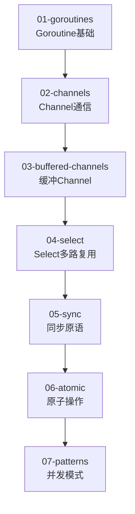

# ⚡ 第三阶段：并发编程 (03-concurrency)

> **学习目标**: 掌握Go语言的并发编程，理解goroutine和channel
>
> **学习时长**: 3-4周
>
> **难度级别**: ⭐️⭐️⭐️ 中高级

---

## 🎯 学习路线图



---

## 📖 子模块详解

### 1️⃣ [01-goroutines](./01-goroutines/) - Goroutine基础 ⭐️核心
**学习要点**:
- Goroutine定义和特点
- go关键字启动goroutine
- WaitGroup等待组
- Goroutine调度器(GPM模型)
- Goroutine vs 操作系统线程

**关键概念**:
```go
// Goroutine调度模型 (M:N调度)
// G: Goroutine (协程)
// M: Machine (操作系统线程)
// P: Processor (处理器，逻辑CPU)
//
// M个goroutine运行在N个OS线程上
// 栈空间初始只有2KB，可动态增长
// 由Go调度器管理，而非操作系统
```

**文档亮点**:
- 详细解释GPM调度模型
- 图示goroutine的工作原理
- 安全的随机数生成示例
- 生产级错误处理

---

### 2️⃣ [02-channels](./02-channels/) - Channel通信 ⭐️核心
**学习要点**:
- Channel创建和使用
- 发送和接收操作
- 关闭channel
- range遍历channel
- 单向channel

**设计哲学**:
> **"不要通过共享内存来通信，而应通过通信来共享内存"**
>
> Don't communicate by sharing memory; share memory by communicating.

**代码示例**:
```go
ch := make(chan int)

// 发送 (阻塞直到有接收者)
go func() {
    ch <- 42
}()

// 接收 (阻塞直到有数据)
value := <-ch
```

---

### 3️⃣ [03-buffered-channels](./03-buffered-channels/) - 缓冲Channel
**学习要点**:
- 缓冲channel vs 无缓冲channel
- 缓冲区大小设计
- len()和cap()函数
- 避免死锁
- 缓冲channel的应用场景

**关键区别**:
```go
// 无缓冲channel: 发送和接收必须同步
ch1 := make(chan int)       // 容量0，同步通信

// 缓冲channel: 缓冲区未满时发送不阻塞
ch2 := make(chan int, 10)   // 容量10，异步通信
```

---

### 4️⃣ [04-select](./04-select/) - Select多路复用 ⭐️重点
**学习要点**:
- select语句基础
- 多channel选择
- default非阻塞操作
- timeout超时控制
- select的应用模式

**经典模式**:
```go
// 超时控制
select {
case result := <-resultCh:
    // 处理结果
case <-time.After(3 * time.Second):
    // 超时处理
}

// 非阻塞发送
select {
case ch <- value:
    // 发送成功
default:
    // channel已满，做其他处理
}
```

---

### 5️⃣ [05-sync](./05-sync/) - 同步原语
**学习要点**:
- sync.Mutex互斥锁
- sync.RWMutex读写锁
- sync.WaitGroup等待组
- sync.Once单次执行
- sync.Pool对象池
- sync.Cond条件变量

**最佳实践**:
```go
// 使用defer确保解锁
mu.Lock()
defer mu.Unlock()
// 临界区代码...

// 读多写少场景用RWMutex
var rwMu sync.RWMutex
rwMu.RLock()         // 读锁，允许多个并发读
defer rwMu.RUnlock()
// 读操作...
```

---

### 6️⃣ [06-atomic](./06-atomic/) - 原子操作
**学习要点**:
- sync/atomic包
- 原子加载(Load)
- 原子存储(Store)
- 原子加法(Add)
- 原子比较交换(CompareAndSwap)
- atomic.Value类型

**性能优势**:
- 比互斥锁更快（无锁编程）
- 适用于简单的计数器、标志位
- 不适用于复杂的临界区

---

### 7️⃣ [07-patterns](./07-patterns/) - 并发模式 🚀高级
**学习要点**:
- 工作池(Worker Pool)模式
- 管道(Pipeline)模式
- 扇入(Fan-in)模式
- 扇出(Fan-out)模式
- 超时和取消模式
- 生产者-消费者模式

**工作池模式示例**:
```go
func workerPool(tasks <-chan Task, results chan<- Result, numWorkers int) {
    var wg sync.WaitGroup

    for i := 0; i < numWorkers; i++ {
        wg.Add(1)
        go func(id int) {
            defer wg.Done()
            for task := range tasks {
                results <- processTask(task)
            }
        }(i)
    }

    wg.Wait()
    close(results)
}
```

---

## 🏆 学习成果检验

完成本阶段后，你应该能够：

- ✅ 理解goroutine的调度机制(GPM模型)
- ✅ 熟练使用channel进行goroutine间通信
- ✅ 使用select实现多路复用和超时控制
- ✅ 正确使用互斥锁和读写锁避免竞态条件
- ✅ 理解并应用常见并发模式
- ✅ 使用原子操作优化简单并发场景

---

## 🚀 运行和测试

```bash
# 在03-concurrency目录下运行所有示例
cd 03-concurrency

# 编译所有子模块
for dir in */; do
    cd "$dir"
    echo "Running $dir..."
    go run *.go
    cd ..
done

# 竞态条件检测（重要！）
cd 05-sync
go run -race *.go  # 检测数据竞争

# 性能分析
cd 07-patterns
go test -bench=. -benchmem
```

---

## 📊 质量统计

- **总模块数**: 7个子模块
- **代码行数**: 约3000行（包含详细注释）
- **注释密度**: 约50%（教学级注释+并发原理讲解）
- **文档亮点**: 01-goroutines/main.go包含GPM调度模型详解

---

## 🔑 重点难点

### ⭐️ 必须掌握
1. **Goroutine**: Go并发的基石，理解栈空间、调度器
2. **Channel**: CSP并发模型核心，同步通信机制
3. **Select**: 多路复用，超时控制，非阻塞操作

### 🔥 进阶内容
4. **并发模式**: 工作池、管道、扇入扇出
5. **Sync包**: 互斥锁、读写锁、WaitGroup、Once
6. **Atomic原子操作**: 无锁编程，性能优化

### ⚠️ 常见陷阱
- **死锁**: channel阻塞导致所有goroutine等待
- **Goroutine泄漏**: 未正确关闭channel或超时控制
- **数据竞争**: 多个goroutine同时访问共享变量
- **过度创建goroutine**: 消耗过多内存

---

## 🛡️ 并发安全最佳实践

### 1. 优先使用Channel
```go
// ✅ 推荐: 使用channel传递数据
ch := make(chan int)
go producer(ch)
consumer(ch)

// ❌ 不推荐: 共享变量+锁（除非必要）
var mu sync.Mutex
var sharedVar int
```

### 2. 避免Goroutine泄漏
```go
// ✅ 推荐: 使用context或done channel控制goroutine生命周期
func worker(ctx context.Context) {
    for {
        select {
        case <-ctx.Done():
            return  // 优雅退出
        case task := <-tasks:
            process(task)
        }
    }
}

// ❌ 不推荐: 无法退出的goroutine
func worker() {
    for task := range tasks {
        process(task)
    }
    // 如果tasks永远不关闭，goroutine会一直运行
}
```

### 3. 使用-race检测竞态条件
```bash
go run -race main.go    # 开发阶段必用
go test -race ./...     # CI/CD必须包含
```

### 4. 正确关闭Channel
```go
// ✅ 发送者负责关闭channel
go func() {
    for _, item := range items {
        ch <- item
    }
    close(ch)  // 发送完毕后关闭
}()

// 接收者使用range自动处理关闭
for item := range ch {
    process(item)
}
```

---

## 🔗 相关资源

### 前置学习
- ⬅️ [02-advanced](../02-advanced/) - 进阶特性（接口、Context等）

### 下一步学习
- ➡️ [04-web](../04-web/) - Web开发（HTTP服务、并发Web服务器）
- ➡️ [07-runtime-internals](../07-runtime-internals/) - 运行时内核（深入GPM调度器）

### 官方资源
- [Go官方博客 - Share Memory By Communicating](https://blog.golang.org/codelab-share)
- [Go官方博客 - Go Concurrency Patterns](https://blog.golang.org/pipelines)
- [Go官方博客 - Advanced Go Concurrency Patterns](https://blog.golang.org/io2013-talk-concurrency)

### 推荐阅读
- [《Go并发编程实战》](https://github.com/golang/go/wiki/LearnConcurrency)
- [Effective Go - Concurrency](https://golang.org/doc/effective_go.html#concurrency)

---

## 💡 学习建议

1. **循序渐进**: 从goroutine→channel→select→sync，不要跳过
2. **竞态检测**: 每个并发程序都用`go run -race`运行一遍
3. **Channel优先**: 能用channel解决的问题不要用锁
4. **小步快跑**: 先写简单的并发程序，逐步增加复杂度
5. **理解原理**: 深入理解GPM调度模型，看01-goroutines的详细注释
6. **模式学习**: 07-patterns的并发模式是实战必备

---

## 🎯 实战练习建议

1. **并发下载器**: 使用工作池模式下载多个文件
2. **爬虫引擎**: 管道模式处理URL队列
3. **限流器**: 使用channel实现令牌桶算法
4. **缓存系统**: RWMutex保护的内存缓存
5. **生产者-消费者**: 缓冲channel实现队列

---

## ⚡ 性能优化提示

- **Goroutine数量**: 通常CPU核心数的2-4倍为最佳
- **Channel缓冲**: 根据生产/消费速度差异设置缓冲区大小
- **避免锁竞争**: 读多写少用RWMutex，简单计数用atomic
- **Context传递**: 使用context.Context控制goroutine生命周期
- **Pool复用**: 使用sync.Pool复用对象减少GC压力

---

**作者**: JIA
**最后更新**: 2025-10-04
**质量标准**: 0错误0警告，最高标准，详尽中文注释
**并发安全**: ✅ 所有示例代码均通过race detector检测
