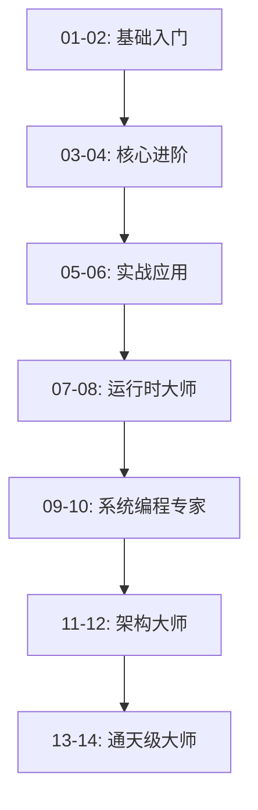

# 🚀 Go语言通天学习指南

本指南将帮助您系统地完成从入门到通天级别的Go语言学习之旅。

## 📚 学习路径总览

### 🎯 学习阶段映射



## 🗓️ 学习时间规划

### 📅 建议学习计划 (24周完整路径)

| 周数 | 模块 | 重点内容 | 学习目标 |
|------|------|----------|----------|
| **1-2周** | `01-basics` | 基础语法、类型系统 | 熟悉Go语言基本概念 |
| **3-4周** | `02-advanced` | 接口、错误处理、反射 | 掌握Go核心特性 |
| **5-6周** | `03-concurrency` | Goroutine、Channel | 精通并发编程 |
| **7-8周** | `04-web` | HTTP服务、数据库 | 能够开发Web应用 |
| **9-10周** | `05-microservices` | 微服务架构 | 掌握分布式系统 |
| **11-12周** | `06-projects` | 实战项目 | 具备项目开发能力 |
| **13-15周** | `07-runtime-internals` | 运行时内核 | 理解Go底层机制 |
| **16-18周** | `08-performance-mastery` | 性能优化 | 成为性能调优专家 |
| **19-20周** | `09-system-programming` | 系统编程 | 掌握底层编程 |
| **21-22周** | `10-compiler-toolchain` | 编译器工具链 | 理解编译原理 |
| **23周** | `11-massive-systems` | 大规模系统 | 架构设计能力 |
| **24周** | `12-ecosystem-contribution` | 生态贡献 | 开源贡献能力 |
| **进阶** | `13-language-design` | 语言设计 | 语言设计理论 |
| **专家** | `14-tech-leadership` | 技术领导力 | 技术影响力 |

## 🎯 分阶段学习指南

### 🌱 第一阶段：基础掌握 (1-4周)

#### 学习目标
- 掌握Go语言基础语法
- 理解Go的类型系统和内存模型
- 能够编写简单的Go程序

#### 学习步骤

**第1-2周：01-basics**
```bash
# 每日学习计划 (2小时)
cd 01-basics

# Day 1-2: 基础语法
01-hello/          # Hello World + 工具链熟悉
02-variables/      # 变量声明和作用域
03-constants/      # 常量和枚举

# Day 3-4: 控制流
04-ifelse/         # 条件语句
05-loops/          # 循环结构
06-switch/         # Switch语句

# Day 5-7: 复合类型
07-arrays/         # 数组操作
08-slices/         # 切片详解
09-maps/           # 映射操作

# Day 8-10: 函数编程
10-structs/        # 结构体设计
11-functions/      # 函数定义
12-methods/        # 方法实现
13-closures/       # 闭包应用

# 每日练习
- 完成每个目录的练习题
- 编写单元测试
- 记录学习笔记
```

**第3-4周：02-advanced**
```bash
# 进阶特性学习
cd 02-advanced

# Week 3: 接口编程
01-interfaces/     # 接口设计原则
02-empty-interface/ # 空接口应用
03-polymorphism/   # 多态实现

# Week 3-4: 错误处理
04-errors/         # 标准错误处理
05-custom-errors/  # 自定义错误类型
06-panic-recover/  # 异常恢复机制

# Week 4: 测试与反射
07-packages/       # 包设计原则
08-testing/        # 单元测试编写
09-benchmarks/     # 性能基准测试
10-reflection/     # 反射机制
11-generics/       # 泛型编程
```

#### 阶段验收标准
- [ ] 能够独立编写包含结构体、接口的Go程序
- [ ] 理解Go的错误处理机制
- [ ] 能够编写单元测试和基准测试
- [ ] 掌握包的设计和使用

### 🚀 第二阶段：并发和Web开发 (5-8周)

#### 学习目标
- 精通Go并发编程
- 能够开发Web应用和API
- 理解Go的并发模型

#### 学习步骤

**第5-6周：03-concurrency**
```bash
cd 03-concurrency

# Week 5: 并发基础
01-goroutines/     # Goroutine创建和管理
02-channels/       # Channel通信机制
03-sync/           # 同步原语使用

# Week 6: 高级并发
04-context/        # Context控制
05-select-patterns/ # Select模式
06-worker-pools/   # 工作池模式
07-rate-limiting/  # 限流实现

# 并发编程练习
- 实现生产者-消费者模式
- 编写并发安全的数据结构
- 性能调优和死锁调试
```

**第7-8周：04-web**
```bash
cd 04-web

# Week 7: Web基础
01-http-basics/    # HTTP服务基础
02-routing-rest/   # RESTful API设计
03-middleware-auth/ # 中间件和认证
04-websocket/      # WebSocket实时通信

# Week 8: 数据和安全
05-database/       # 数据库操作
06-templates/      # 模板引擎
07-file-upload/    # 文件上传处理
08-caching/        # 缓存策略
09-testing/        # Web应用测试
10-security/       # 安全最佳实践
```

#### 阶段验收标准
- [ ] 能够设计和实现高并发系统
- [ ] 掌握Channel的各种使用模式
- [ ] 能够开发完整的Web应用
- [ ] 理解Web安全和性能优化

### 🏗️ 第三阶段：微服务和项目实战 (9-12周)

#### 学习目标
- 掌握微服务架构设计
- 能够开发分布式系统
- 具备项目架构能力

#### 学习步骤

**第9-10周：05-microservices**
```bash
cd 05-microservices

# Week 9: 微服务基础
01-service-discovery/ # 服务发现
02-api-gateway/      # API网关
03-configuration/    # 配置管理
04-messaging/        # 消息队列

# Week 10: 分布式系统
05-distributed-transactions/ # 分布式事务
06-monitoring/       # 监控和日志
07-circuit-breaker/  # 熔断器
08-containerization/ # 容器化
09-rate-limiting/    # 分布式限流
10-docker/           # Docker实践
11-kubernetes/       # K8s部署
```

**第11-12周：06-projects**
```bash
cd 06-projects

# 选择2-3个项目深入实现
01-blog-system/      # 博客系统 (Web开发综合)
02-ecommerce-backend/ # 电商后端 (微服务架构)
03-chat-system/      # 聊天系统 (实时通信)
04-task-scheduler/   # 任务调度 (分布式系统)
05-monitoring-system/ # 监控系统 (数据收集)
06-file-storage/     # 文件存储 (对象存储)

# 项目开发流程
- 需求分析和架构设计
- 编码实现和单元测试
- 集成测试和性能测试
- 部署和监控
```

#### 阶段验收标准
- [ ] 能够设计微服务架构
- [ ] 掌握分布式系统核心概念
- [ ] 完成至少2个完整项目
- [ ] 具备DevOps基础能力

### 🔬 第四阶段：运行时大师 (13-18周)

#### 学习目标
- 深入理解Go运行时机制
- 掌握性能调优技巧
- 成为Go内核专家

#### 学习步骤

**第13-15周：07-runtime-internals**
```bash
cd 07-runtime-internals

# 运行时内核深入
01-gc-internals/     # 垃圾收集器原理
02-scheduler-internals/ # 调度器实现
03-memory-allocator/ # 内存分配器
04-stack-management/ # 栈管理机制
05-channel-internals/ # Channel底层实现

# 学习方法
- 阅读Go源码
- 实验验证原理
- 性能测试分析
- 编写分析工具
```

**第16-18周：08-performance-mastery**
```bash
cd 08-performance-mastery

# 性能优化专精
01-advanced-profiling/ # 高级性能分析
02-production-monitoring/ # 生产环境监控
03-optimization-techniques/ # 优化技巧
04-distributed-profiling/ # 分布式性能分析
05-production-profiling/ # 生产环境调优

# 性能优化实践
- CPU使用率优化
- 内存使用优化
- GC调优策略
- 并发性能优化
```

#### 阶段验收标准
- [ ] 理解Go运行时各个组件
- [ ] 能够进行深度性能调优
- [ ] 掌握生产环境问题诊断
- [ ] 能够阅读和理解Go源码

### ⚙️ 第五阶段：系统编程专家 (19-22周)

#### 学习目标
- 掌握底层系统编程
- 理解编译器原理
- 具备工具开发能力

#### 学习步骤

**第19-20周：09-system-programming**
```bash
cd 09-system-programming

# 系统编程深入
01-unsafe-programming/ # Unsafe指针操作
02-cgo-mastery/       # C语言互操作
03-system-calls/      # 系统调用
04-zero-copy-io/      # 零拷贝IO
05-memory-mapping/    # 内存映射
```

**第21-22周：10-compiler-toolchain**
```bash
cd 10-compiler-toolchain

# 编译器工具链
01-ast-manipulation/  # AST操作
02-code-generation/   # 代码生成
03-build-constraints/ # 构建约束
04-custom-tools/      # 自定义工具
05-optimization/      # 编译优化
```

#### 阶段验收标准
- [ ] 掌握底层内存操作
- [ ] 能够进行C/Go互操作
- [ ] 理解编译器工作原理
- [ ] 能够开发编译器工具

### 🏛️ 第六阶段：架构大师 (23-24周)

#### 学习目标
- 掌握大规模系统设计
- 具备开源贡献能力
- 成为技术领导者

#### 学习步骤

**第23周：11-massive-systems**
```bash
cd 11-massive-systems

# 大规模系统设计
01-million-goroutines/ # 百万级并发
02-distributed-consensus/ # 分布式共识
03-extreme-performance/ # 极致性能
04-cloud-native-expert/ # 云原生专家
05-observability-master/ # 可观测性大师
```

**第24周：12-ecosystem-contribution**
```bash
cd 12-ecosystem-contribution

# 生态贡献
01-stdlib-contribution/ # 标准库贡献
02-open-source-leadership/ # 开源领导力
03-community-building/  # 社区建设
04-tech-evangelism/     # 技术布道
05-best-practices/      # 最佳实践
```

#### 阶段验收标准
- [ ] 能够设计百万级并发系统
- [ ] 具备开源项目维护能力
- [ ] 掌握云原生技术栈
- [ ] 具备技术影响力

### 🚀 第七阶段：通天级大师 (进阶阶段)

#### 学习目标
- 参与语言设计
- 具备技术领导力
- 成为Go生态贡献者

#### 学习步骤

**语言设计阶段：13-language-design**
```bash
cd 13-language-design

# 语言设计理论
01-go2-features/      # Go 2.0特性设计
02-compiler-optimization/ # 编译器优化
03-gc-algorithms/     # GC算法设计
04-vm-implementation/ # 虚拟机实现
05-cross-language-interop/ # 跨语言互操作
```

**技术领导力：14-tech-leadership**
```bash
cd 14-tech-leadership

# 技术领导力
01-core-contributor/  # 核心贡献者
02-conference-speaking/ # 会议演讲
03-book-writing/      # 技术写作
04-enterprise-consulting/ # 企业咨询
05-innovation-research/ # 创新研究
```

#### 阶段验收标准
- [ ] 参与Go语言核心开发
- [ ] 具备技术会议演讲能力
- [ ] 出版技术书籍或文章
- [ ] 成为技术意见领袖

## 🛠️ 学习工具和环境

### 开发环境设置
```bash
# Docker环境 (推荐)
docker-compose up go-mastery-dev

# 或本地环境
make setup
```

### 学习辅助工具
```bash
# 代码质量检查
make quality-check

# 运行测试
make test

# 性能基准测试
make bench

# 生成覆盖率报告
make coverage
```

## 📊 学习进度追踪

### 进度检查清单

#### 基础阶段 ✅
- [ ] 01-basics: 基础语法掌握
- [ ] 02-advanced: 进阶特性理解
- [ ] 阶段项目: 实现一个命令行工具

#### 应用阶段 ✅
- [ ] 03-concurrency: 并发编程精通
- [ ] 04-web: Web开发能力
- [ ] 阶段项目: 开发一个Web API

#### 架构阶段 ✅
- [ ] 05-microservices: 微服务架构
- [ ] 06-projects: 实战项目完成
- [ ] 阶段项目: 完整微服务系统

#### 专家阶段 🔬
- [ ] 07-runtime-internals: 运行时内核理解
- [ ] 08-performance-mastery: 性能优化精通
- [ ] 阶段项目: 性能调优案例

#### 大师阶段 ⚙️
- [ ] 09-system-programming: 系统编程掌握
- [ ] 10-compiler-toolchain: 编译器工具链
- [ ] 阶段项目: 编译器插件

#### 通天阶段 🚀
- [ ] 11-massive-systems: 大规模系统设计
- [ ] 12-ecosystem-contribution: 生态贡献
- [ ] 13-language-design: 语言设计理论
- [ ] 14-tech-leadership: 技术领导力
- [ ] 终极项目: Go生态重大贡献

## 🎯 学习建议

### 最佳实践
1. **渐进式学习**: 严格按照顺序学习，不要跳跃
2. **实践导向**: 每个概念都要编写代码验证
3. **测试驱动**: 为关键代码编写测试
4. **源码阅读**: 多读优秀项目源码
5. **社区参与**: 积极参与Go社区讨论

### 学习时间分配
- **理论学习**: 30% (阅读文档、观看视频)
- **代码实践**: 50% (编写代码、调试)
- **项目应用**: 20% (实战项目、开源贡献)

### 困难应对策略
1. **遇到困难时**: 查看代码注释和文档
2. **理解不透时**: 多编写示例代码
3. **性能问题时**: 使用profiling工具
4. **设计问题时**: 参考优秀项目架构

## 🆘 获取帮助

### 内部资源
- 每个模块的README文档
- 代码注释和示例
- 测试用例参考

### 外部资源
- [Go官方文档](https://golang.org/doc/)
- [Go语言圣经](https://books.studygolang.com/gopl-zh/)
- [Effective Go](https://golang.org/doc/effective_go)
- [Go语言中文网](https://studygolang.com)

### 社区支持
- Go语言官方论坛
- Stack Overflow Go标签
- GitHub Go项目Issues
- Go语言QQ群/微信群

---

**🚀 开始您的Go语言通天之旅吧！每一行代码都是向专家级别迈进的一步！**